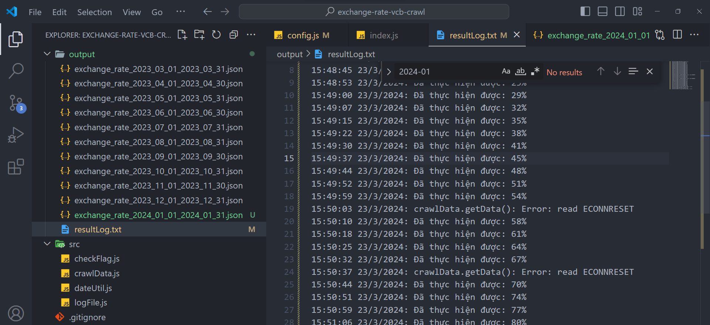
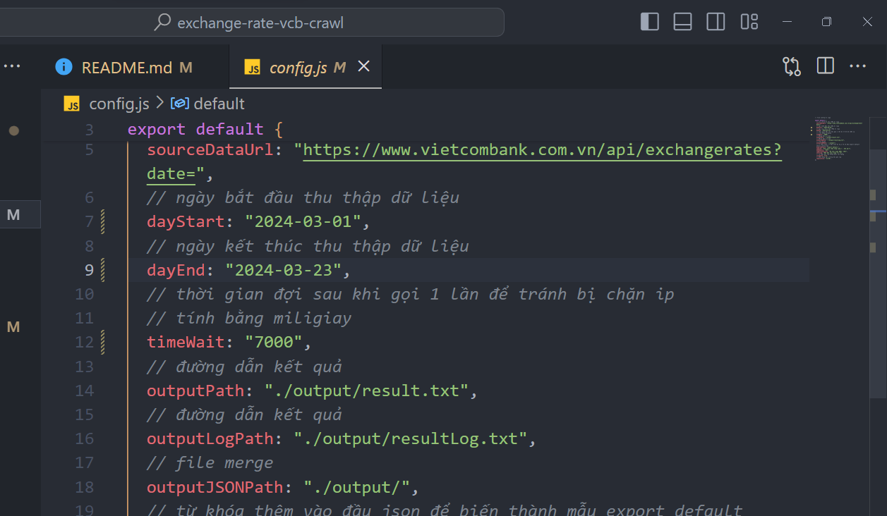

## Tool lấy toàn bộ dữ liệu ở trang vcb về trong vòng 1 năm tính từ thời điểm hiện tại trở về quá khứ

Bên vietcombank cung cấp đầu api lấy dữ liệu theo ngày
Ví dụ ngày 2023-02-21

```
https://www.vietcombank.com.vn/api/exchangerates?date=2023-02-21
```

Để chạy được tool này cần thực hiện các bước sau

Cài đặt thư viện cần dùng

```
npm install
```

chạy tool

```
node index.js
```

hoặc có thể mở file index.js rồi ấn f5 để chạy ở chế độ debug

để xem log, vào trong file như hình dưới. dòng nào mà ghi đã thực hiện được là ngày đó đã lấy được, dòng nào ghi lỗi thì chỉ cần lấy lại đúng ngày đó



để xem config lấy từ ngày nào tới ngày nào, thời gian dừng giữa các lần lấy thì xem thế nào


